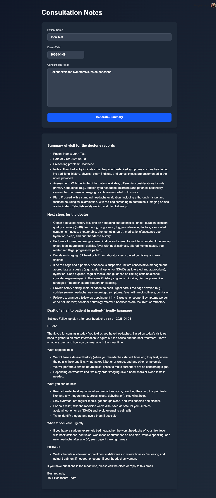

# MediNotes Pro

AI-powered healthcare consultation assistant that generates professional summaries, action items, and patient communications from consultation notes in real-time.



## Stack

- **Frontend:** Next.js 16, React 19, TypeScript, TailwindCSS 4
- **Backend:** FastAPI (Python), Server-Sent Events (SSE)
- **AI:** OpenAI API (streamed responses)
- **Auth:** Clerk (authentication + subscription management)

## Features

- Professional medical record summaries from consultation notes
- Action items and follow-up steps per consultation
- Patient-friendly email draft generation
- Premium subscription gating via Clerk

## Getting Started

### Prerequisites

- Node.js 22
- Python 3.12 with `uv`
- OpenAI API key
- Clerk account (publishable key, secret key, JWKS URL)

### Environment

Create a `.env.local` file in the project root:

```env
OPENAI_API_KEY=your_key_here
NEXT_PUBLIC_CLERK_PUBLISHABLE_KEY=your_clerk_publishable_key
CLERK_SECRET_KEY=your_clerk_secret_key
CLERK_JWKS_URL=https://<your-clerk-domain>/.well-known/jwks.json
```

### Run the frontend

```bash
npm run dev
```

### Run the backend

```bash
uv run uvicorn api.server:app --reload --port 8001
```

Open [http://localhost:3000](http://localhost:3000) to view the app.

## Deployment

The app runs as a single container: a Node.js server (Next.js) on port 8000 proxies `/api/*` requests to an internal FastAPI process on port 8001.

Commands are identical for Docker and Podman — substitute `podman` for `docker` as needed.

### Build

```bash
docker build \
  --build-arg NEXT_PUBLIC_CLERK_PUBLISHABLE_KEY=pk_... \
  -t health-consult .
```

### Run

```bash
docker run -p 8000:8000 \
  -e CLERK_JWKS_URL=https://<your-clerk-domain>/.well-known/jwks.json \
  -e OPENAI_API_KEY=... \
  health-consult
```

Open [http://localhost:8000](http://localhost:8000).

### Podman notes

Podman runs rootless by default. If port binding fails, use a port above 1024 or enable unprivileged port binding:

```bash
sudo sysctl net.ipv4.ip_unprivileged_port_start=80
```

To keep the container running as a systemd service:

```bash
podman generate systemd --name health-consult --new > ~/.config/systemd/user/health-consult.service
systemctl --user enable --now health-consult
```
